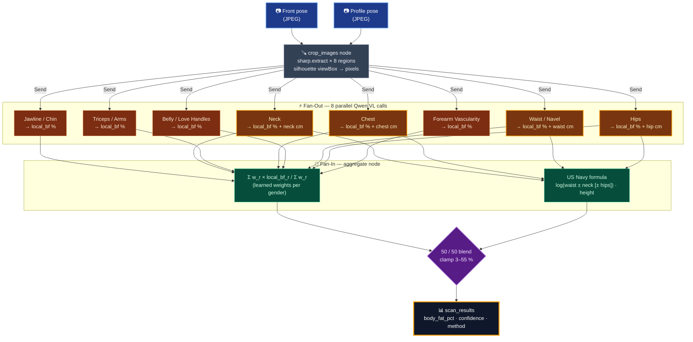
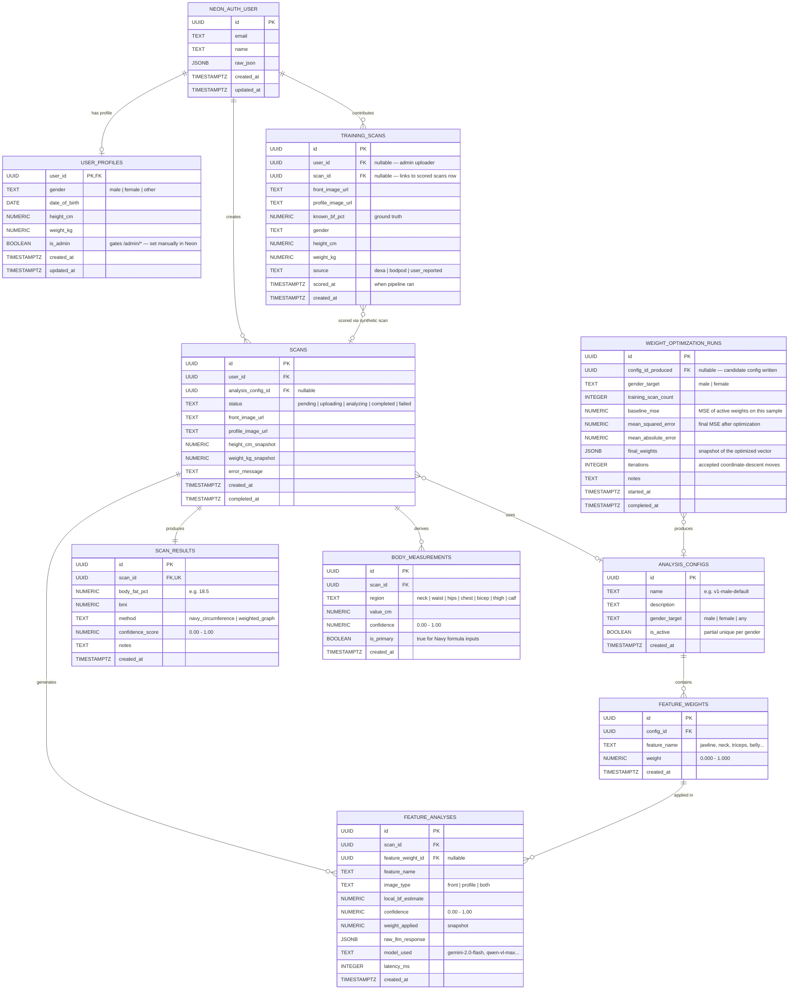
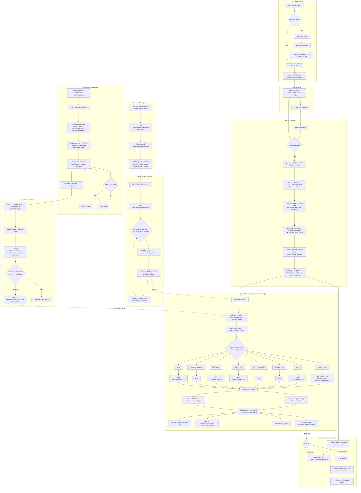

# Body Scan

**Qwen AI Build Day Hackathon -- Healthcare Track, Challenge #2**

Measuring body fat % typically requires specialized, expensive equipment (DEXA scans, BodPod, hydrostatic weighing). Most people don't have easy access. Body Scan solves this by estimating body fat percentage and body measurements from just two photos -- a front view and a side profile.

## How It Works

1. **User fills in** gender, date of birth, height, and weight on `/profile`.
2. **User captures** a front-facing and side-profile photo using the in-browser camera. A translucent silhouette + alignment grid overlay on the live video feed guides consistent framing so the downstream crop/fan-out logic behaves the same for every scan.
3. **Photos upload directly** to Vercel Blob from the browser (bypassing serverless body-size limits) under a per-scan namespace (`scans/<scanId>/{front,profile}.jpg`).
4. **AI graph pipeline** (Phase 3) breaks each image into isolated body regions (jawline, neck, triceps, belly, love handles, forearms, etc.) and analyzes each one independently using a Vision-Language Model.
5. **Fan-in aggregation** combines per-region estimates with configurable weights to produce a final body fat % and circumference measurements.
6. **Results are stored** so users can track their body composition trends over time with charts.

### Why a Graph Architecture?

Asking a single VLM to analyze an entire body photo at once leads to hallucination and unreliable estimates. By **fanning out** the image into focused regions -- each analyzed in isolation with managed context -- and then **fanning in** the results with tunable weights, we get significantly more accurate and reproducible data.

This is implemented using [LangGraph](https://langchain-ai.github.io/langgraphjs/) (LangChain), where each graph node represents a specific body region analysis. The architecture also supports:

- **Swappable LLMs** -- switch between Gemini and Qwen models per node
- **Configurable weights** -- control how much each body region contributes to the final estimate
- **Training pipeline** -- refine feature extraction and weights from labeled datasets (supervised learning)

### Estimation Method

Inspired by the **US Navy circumference method**, which estimates body fat from neck, waist, and hip circumferences combined with height. In our approach, the VLM-derived circumferences replace tape measurements:

- **Male:** BF% = 86.010 x log10(waist - neck) - 70.041 x log10(height) + 36.76
- **Female:** BF% = 163.205 x log10(waist + hip - neck) - 97.684 x log10(height) + 78.387

Height is the only user-provided measurement. All circumferences are estimated from the photos.



## Tech Stack

| Layer | Technology |
|-------|------------|
| Frontend | Next.js 16 (App Router), TypeScript, Tailwind CSS v4 |
| Camera | Browser `MediaDevices.getUserMedia` + SVG silhouette overlays |
| Image Storage | [Vercel Blob](https://vercel.com/docs/storage/vercel-blob) (client-upload) |
| Database | PostgreSQL on [Neon](https://neon.tech) |
| Auth | Neon Auth (Google OAuth) |
| AI Pipeline | [LangGraph](https://langchain-ai.github.io/langgraphjs/) (LangChain JS) -- fan-out/fan-in graph |
| Image Processing | [sharp](https://sharp.pixelplumbing.com/) -- server-side region cropping |
| LLM Providers | Google Gemini, Qwen VL (via [OpenRouter](https://openrouter.ai)) |
| Hosting | Vercel |

## Implementation Status

- [x] **Phase 1** -- Auth (Google OAuth via Neon Auth) + full DB schema with migration runner
- [x] **Phase 2** -- Profile form, standardized in-browser camera capture with silhouette overlays, Vercel Blob upload pipeline
- [x] **Phase 3** -- LangGraph fan-out/fan-in VLM analysis, Navy-formula aggregation, results page with polling
- [x] **Phase 4** -- Dashboard with historical scans and trendline charts (Recharts)
- [x] **Phase 5** -- Admin "ML weight refinement" loop: upload labeled training images, score via the production pipeline, run coordinate-descent optimizer over `feature_weights` to minimize MSE vs known BF%, promote the best config live

## Architecture

See detailed diagrams:
- [Database ERD](docs/ERD.md)


  
- [Information Flow Diagram](docs/IFD.md)



## Getting Started

### Prerequisites

- Node.js 18+
- A [Neon](https://neon.tech) database with Auth enabled
- Google OAuth credentials configured in Neon Auth
- A Vercel Blob store (create one in the Vercel dashboard -- Storage -> Blob). In production the `BLOB_READ_WRITE_TOKEN` is injected automatically when the store is linked to the project.

### Setup

```bash
# Install dependencies
npm install

# Copy environment template and fill in your values
cp .env.example .env.local

# Run database migrations
npm run db:migrate

# Start development server
npm run dev

# (Optional) Run the offline weight optimizer once you've uploaded
# labeled training scans through /admin/training
npm run optimize:weights -- --gender male
npm run optimize:weights -- --gender female --persist
```

### Environment Variables

| Variable | Description |
|----------|-------------|
| `DATABASE_URL` | Neon PostgreSQL connection string |
| `NEON_AUTH_BASE_URL` | Neon Auth endpoint URL |
| `NEON_AUTH_COOKIE_SECRET` | Auth cookie secret (`openssl rand -base64 32`) |
| `BLOB_READ_WRITE_TOKEN` | Vercel Blob store token (auto-injected on Vercel when a store is linked; required in `.env.local` for local uploads) |
| `VLM_PROVIDER` | `gemini` (default) or `qwen` |
| `VLM_MODEL` | Model name override (default: `gemini-2.0-flash` / `qwen/qwen2.5-vl-72b-instruct`) |
| `GOOGLE_API_KEY` | Google AI API key (required when `VLM_PROVIDER=gemini`) |
| `OPENROUTER_API_KEY` | OpenRouter API key (required when `VLM_PROVIDER=qwen`) |

### Admin access

The `/admin/training` and `/admin/optimize` pages are gated by `user_profiles.is_admin`. There is no UI for self-promotion — set the flag directly in Neon Studio:

```sql
UPDATE user_profiles SET is_admin = true WHERE user_id = '<your-uuid>';
```

The header shows `Training` and `Optimize` links only for admins; regular users won't see them and direct navigation to `/admin/*` returns 404.

### Local camera testing

`getUserMedia` is gated to secure contexts. `http://localhost:3000` counts as secure, so `npm run dev` works without extra setup. If you need to test from another device on your LAN, front the dev server with an HTTPS tunnel.

## Project Structure

```
src/
  app/
    login/                          # Google OAuth sign-in
    (authenticated)/                # Protected routes
      dashboard/                    # Scan history + trendline charts (Phase 4)
      admin/
        training/                   # Upload labeled scans + "Score all" action (Phase 5)
        optimize/                   # Run optimizer, compare weight vectors, promote (Phase 5)
      profile/
        page.tsx                    # Server: loads user_profiles
        profile-form.tsx            # Client: gender / DOB / height / weight
      scan/new/
        page.tsx                    # Server: profile-completeness guard
        scan-capture.tsx            # Client: 3-step front/profile/review flow
        silhouette.tsx              # Front + profile silhouette SVGs, alignment grid
      scan/[id]/
        page.tsx                    # Server: scan results (analyzing/completed/failed)
        scan-polling.tsx            # Client: 3s polling during analysis
    api/
      auth/[...path]/               # Neon Auth catch-all handler
      profile/                      # POST -- upsert user_profiles
      scan/                         # POST -- create scan (status=uploading, snapshots h/w)
      scan/[id]/finalize/           # POST -- save blob URLs, dispatch pipeline via after()
      scan/[id]/status/             # GET -- lightweight status polling endpoint
      blob/upload/                  # handleUpload token handler for @vercel/blob
      admin/
        training/                   # POST upload (blob token), POST insert training_scan,
                                    #   POST score-all (runs pipeline against each unscored row)
        optimize/                   # POST run optimizer, POST promote candidate config
  lib/
    auth/                           # Auth server + client config
    db.ts                           # Neon SQL client
    admin.ts                        # DB-backed isAdmin(userId) gate (Phase 5)
    pipeline/
      state.ts                      # LangGraph state annotation (Annotation.Root)
      regions.ts                    # 8 body region definitions (bounding boxes + prompts)
      providers.ts                  # VLM factory (Gemini / Qwen via OpenRouter)
      crop.ts                       # Node 1: image download + sharp crop per region
      analyze.ts                    # Nodes 2-9: multimodal VLM call per region (fan-out)
      aggregate.ts                  # Node 10: weighted avg + Navy formula + DB writes (fan-in)
      navy.ts                       # Shared Navy-formula helper (used by aggregator + optimizer)
      graph.ts                      # Graph wiring, runPipeline / runPipelineWithInputs
    optimize/
      weight-optimizer.ts           # Pure coordinate-descent over the weight vector (Phase 5)
      load-samples.ts               # Build OptimizerSample[] from scored training scans
  scripts/
    optimize-weights.ts             # CLI entry for `npm run optimize:weights`
  db/
    migrations/
      001_create_schema.sql         # Full DB schema
      002_seed_analysis_configs.sql # Default male/female feature weights
      003_phase5_training.sql       # is_admin flag, training_scan linkage, run snapshot cols
    migrate.ts                      # Migration runner
```

## Scan Capture Flow

The `/scan/new` experience is a three-step client flow, gated server-side on profile completeness:

1. **Front pose** -- Live camera with a green body silhouette overlay and rule-of-thirds grid. User aligns body inside the silhouette; a 3-second countdown gives time to settle before the canvas grab.
2. **Profile (side) pose** -- Same UI with a blue side-profile silhouette.
3. **Review** -- Thumbnails of both captures with retake buttons; Submit sends both images through the upload pipeline.

Submit triggers:

```
POST /api/scan                 -> { id }  (status='uploading')
@vercel/blob upload() x2       -> scans/<id>/{front,profile}.jpg
POST /api/scan/<id>/finalize   -> status='analyzing', response sent immediately
  └─ after() dispatches LangGraph pipeline in background
       ├─ crop_images: sharp crops 8 body regions from front image
       ├─ analyze_region ×8: parallel VLM calls (Gemini or Qwen)
       └─ aggregate: weighted avg + Navy formula → scan_results
```

The captured frame is written un-mirrored even when the user-facing camera is selected, so anatomical left/right stays correct for the downstream VLM.

### Analysis Pipeline

After finalize, the client redirects to `/scan/<id>` which polls `GET /api/scan/<id>/status` every 3 seconds. The LangGraph pipeline runs in the background via Next.js `after()`:

1. **Crop** -- Downloads both images from Vercel Blob, crops 8 body regions using `sharp` based on bounding boxes mapped from the silhouette viewBox (100x177) to actual pixel coordinates.
2. **Analyze (fan-out)** -- 8 parallel VLM calls, one per region. Each receives a cropped image + a tuned system prompt requesting a JSON response with `local_bf_estimate`, `confidence`, `explanation`, and optionally `circumference_cm`.
3. **Aggregate (fan-in)** -- Computes weighted average BF% from per-region estimates, Navy formula BF% from circumference estimates, BMI, and writes `feature_analyses`, `body_measurements`, and `scan_results` rows. Sets `scans.status = 'completed'`.

The VLM provider is controlled by `VLM_PROVIDER` env var (`gemini` or `qwen`). Qwen is accessed via [OpenRouter](https://openrouter.ai) since DashScope is unavailable in India.

## Weight Optimization (Phase 5)

The aggregator blends a weighted average of per-region BF estimates (50%) with the Navy-formula estimate (50%). The 8 weights originally came from hand-tuned guesses seeded in `002_seed_analysis_configs.sql`. Phase 5 refines those weights against ground truth:

1. **Upload labeled data** at `/admin/training`: front + profile photos, known BF% (from DEXA / BodPod / hydrostatic weighing), gender, optional height / weight, and a free-text source.
2. **Score** each unscored row — clicking "Score all" creates a synthetic `scans` row per training sample and runs the same LangGraph pipeline used in production, so per-region estimates land in `feature_analyses` and circumferences land in `body_measurements`.
3. **Optimize** at `/admin/optimize`: coordinate-descent search over the weight vector starting from the currently-active config, transferring probability mass between region pairs and accepting the best improving move each pass. Loss function mirrors the aggregator's 50/50 Navy blend exactly (see `src/lib/optimize/weight-optimizer.ts`).
4. **Promote** the candidate: toggling `is_active` via the partial unique index on `analysis_configs(gender_target) WHERE is_active = true` atomically swaps the live config. The next real scan picks up the new weights.

Because per-region estimates are persisted after scoring, the optimizer runs in milliseconds — no additional VLM calls. The CLI `npm run optimize:weights` mirrors the in-app flow for demos and headless runs.

## Target Audience

Health-conscious people following a fitness routine who want to track body composition changes over time without expensive equipment. Users are expected to have access to a regular scale and tape measure for height -- the app handles everything else from photos.

## License

MIT
