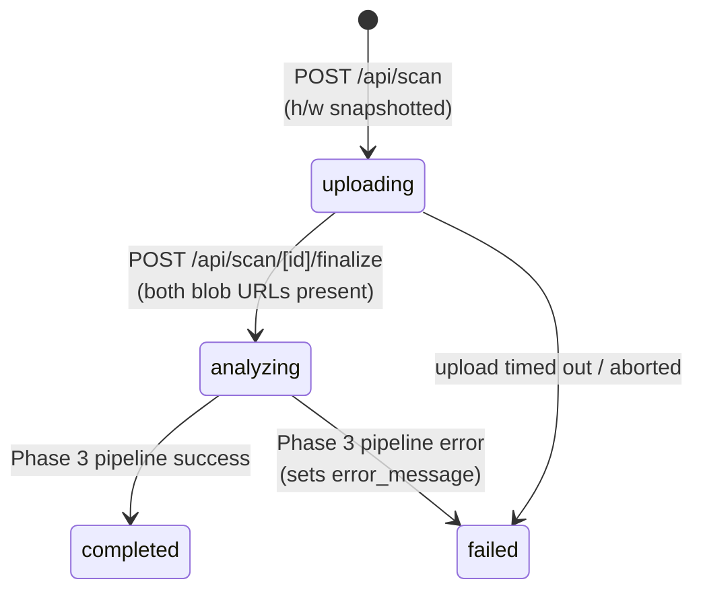

# Database Entity Relationship Diagram

```mermaid
erDiagram
    %% ============================================================
    %% Neon Auth (managed externally)
    %% ============================================================
    NEON_AUTH_USER {
        UUID id PK
        TEXT email
        TEXT name
        JSONB raw_json
        TIMESTAMPTZ created_at
        TIMESTAMPTZ updated_at
    }

    %% ============================================================
    %% Application Tables
    %% ============================================================
    USER_PROFILES {
        UUID user_id PK, FK
        TEXT gender "male | female | other"
        DATE date_of_birth
        NUMERIC height_cm
        NUMERIC weight_kg
        TIMESTAMPTZ created_at
        TIMESTAMPTZ updated_at
    }

    ANALYSIS_CONFIGS {
        UUID id PK
        TEXT name "e.g. v1-male-default"
        TEXT description
        TEXT gender_target "male | female | any"
        BOOLEAN is_active "partial unique per gender"
        TIMESTAMPTZ created_at
    }

    FEATURE_WEIGHTS {
        UUID id PK
        UUID config_id FK
        TEXT feature_name "jawline, neck, triceps, belly..."
        NUMERIC weight "0.000 - 1.000"
        TIMESTAMPTZ created_at
    }

    SCANS {
        UUID id PK
        UUID user_id FK
        UUID analysis_config_id FK "nullable"
        TEXT status "pending | uploading | analyzing | completed | failed"
        TEXT front_image_url
        TEXT profile_image_url
        NUMERIC height_cm_snapshot
        NUMERIC weight_kg_snapshot
        TEXT error_message
        TIMESTAMPTZ created_at
        TIMESTAMPTZ completed_at
    }

    SCAN_RESULTS {
        UUID id PK
        UUID scan_id FK, UK
        NUMERIC body_fat_pct "e.g. 18.5"
        NUMERIC bmi
        TEXT method "navy_circumference | weighted_graph"
        NUMERIC confidence_score "0.00 - 1.00"
        TEXT notes
        TIMESTAMPTZ created_at
    }

    BODY_MEASUREMENTS {
        UUID id PK
        UUID scan_id FK
        TEXT region "neck | waist | hips | chest | bicep | thigh | calf"
        NUMERIC value_cm
        NUMERIC confidence "0.00 - 1.00"
        BOOLEAN is_primary "true for Navy formula inputs"
        TIMESTAMPTZ created_at
    }

    FEATURE_ANALYSES {
        UUID id PK
        UUID scan_id FK
        UUID feature_weight_id FK "nullable"
        TEXT feature_name
        TEXT image_type "front | profile | both"
        NUMERIC local_bf_estimate
        NUMERIC confidence "0.00 - 1.00"
        NUMERIC weight_applied "snapshot"
        JSONB raw_llm_response
        TEXT model_used "gemini-2.0-flash, qwen-vl-max..."
        INTEGER latency_ms
        TIMESTAMPTZ created_at
    }

    TRAINING_SCANS {
        UUID id PK
        UUID user_id FK "nullable"
        TEXT front_image_url
        TEXT profile_image_url
        NUMERIC known_bf_pct "ground truth"
        TEXT gender
        NUMERIC height_cm
        NUMERIC weight_kg
        TEXT source "dexa | bodpod | user_reported"
        TIMESTAMPTZ created_at
    }

    WEIGHT_OPTIMIZATION_RUNS {
        UUID id PK
        UUID config_id_produced FK "nullable"
        INTEGER training_scan_count
        NUMERIC mean_absolute_error
        NUMERIC mean_squared_error
        TEXT notes
        TIMESTAMPTZ started_at
        TIMESTAMPTZ completed_at
    }

    %% ============================================================
    %% Relationships
    %% ============================================================
    NEON_AUTH_USER ||--o| USER_PROFILES : "has profile"
    NEON_AUTH_USER ||--o{ SCANS : "creates"
    NEON_AUTH_USER ||--o{ TRAINING_SCANS : "contributes"

    SCANS ||--|| SCAN_RESULTS : "produces"
    SCANS ||--o{ BODY_MEASUREMENTS : "derives"
    SCANS ||--o{ FEATURE_ANALYSES : "generates"
    SCANS }o--o| ANALYSIS_CONFIGS : "uses"

    ANALYSIS_CONFIGS ||--o{ FEATURE_WEIGHTS : "contains"
    FEATURE_WEIGHTS ||--o{ FEATURE_ANALYSES : "applied in"

    WEIGHT_OPTIMIZATION_RUNS }o--o| ANALYSIS_CONFIGS : "produces"
```



## Design Notes

- **Height/weight snapshots** on `scans` avoid temporal joins for trendline queries.
- **Partial unique index** on `analysis_configs(gender_target) WHERE is_active = true` ensures only one active config per gender.
- **`is_primary` flag** on `body_measurements` distinguishes Navy formula inputs (neck, waist, hips) from secondary tracking regions.
- **`feature_analyses`** is the bridge between the LangGraph pipeline and the database -- each fan-out node writes one row, the fan-in node reads all rows for a scan to produce `scan_results`.
- **`raw_llm_response`** (JSONB) stores full VLM output for debugging and retraining.
- **`weight_applied`** is denormalized into `feature_analyses` so results are auditable even if the config changes later.

## Scan Status Lifecycle

`scans.status` transitions are managed by the API routes:



- `pending` is reserved for future flows where a scan row is created before image capture begins; Phase 2 always starts in `uploading`.
- The finalize endpoint will only accept URLs on `*.public.blob.vercel-storage.com` and only flips status from `uploading`/`pending` (idempotent on retry, safe against race conditions).

## Blob Storage Layout

Images are stored in Vercel Blob under a deterministic namespace so the pipeline can locate them by scan id:

```
scans/<scanId>/front.jpg
scans/<scanId>/profile.jpg
```

Pathnames are enforced by `/api/blob/upload` -- the client cannot supply an alternate path. Ownership is enforced by verifying `scans.user_id = session.user.id` before minting the upload token.
