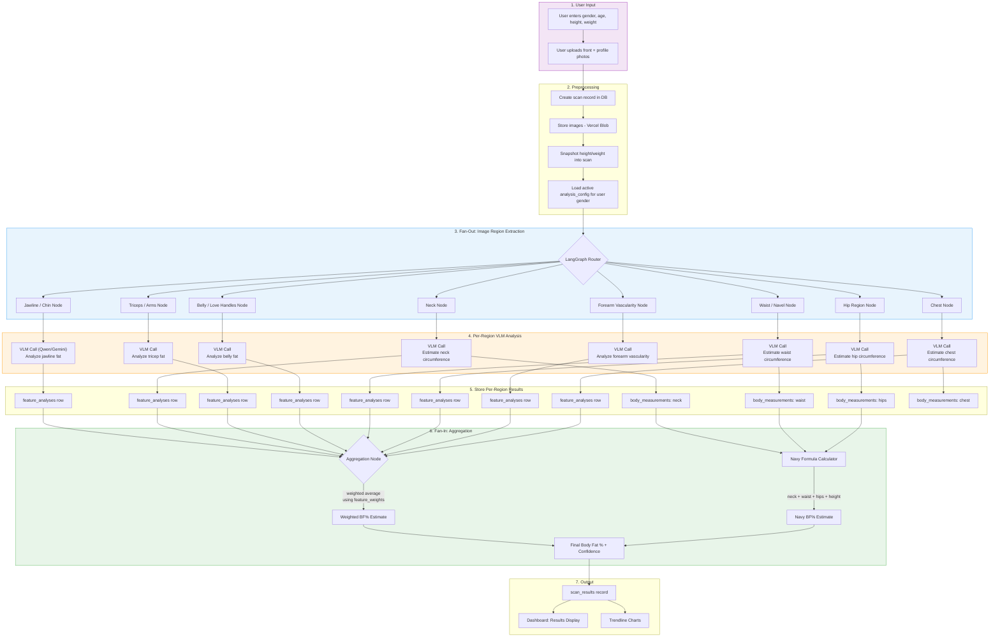
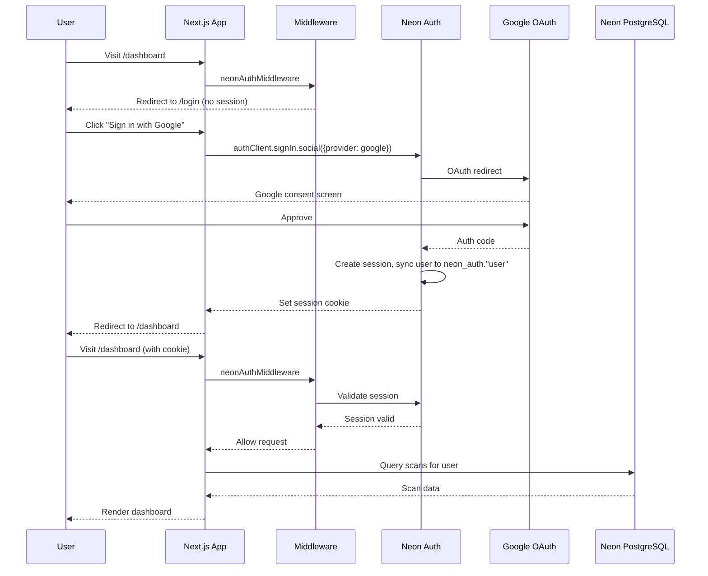
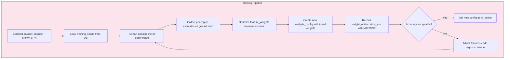

# Information Flow Diagram

## End-to-End Scan Flow

## Authentication Flow

## Training / Weight Optimization Flow

## Key Design Principles

1. **Fan-out mitigates hallucination** -- Each VLM call receives only an isolated body region, not the full image. This focused context produces more reliable estimates than whole-body analysis.

2. **Configurable weights** -- Each body region's contribution to the final estimate is controlled by `feature_weights`. Regions that are more reliable indicators (neck, waist) carry higher weights.

3. **Model-agnostic** -- The `model_used` field on `feature_analyses` allows different nodes to use different LLMs. We can A/B test Qwen vs Gemini per region.

4. **Auditable results** -- Every VLM response is stored as JSONB. The weight applied to each analysis is snapshotted. Results are fully reproducible and debuggable.

5. **Trendlines from snapshots** -- Height and weight are snapshotted into each scan, making trendline queries simple joins without temporal profile lookups.
